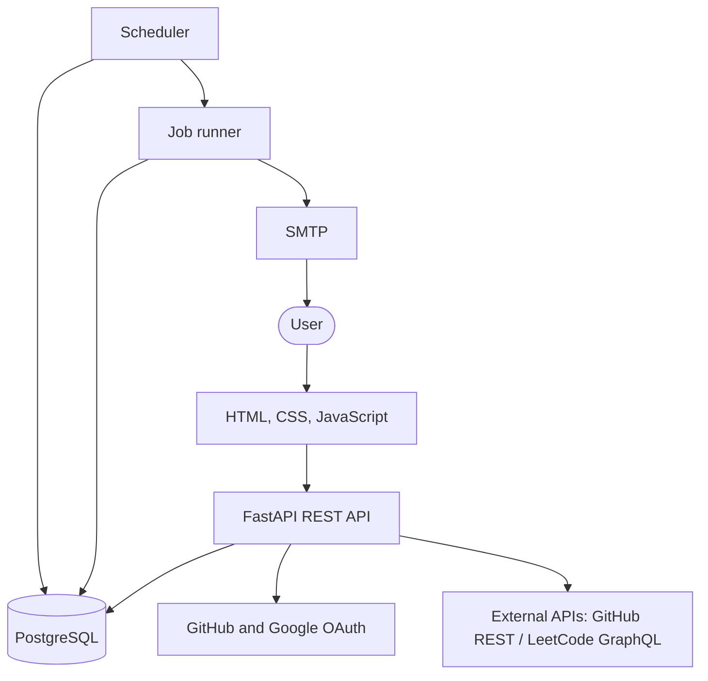
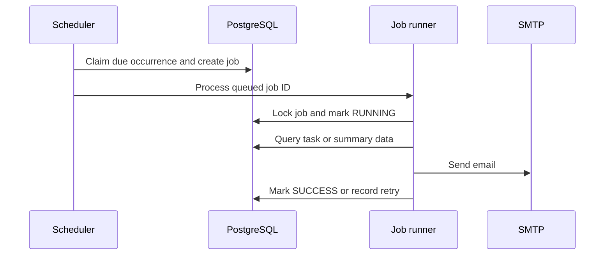

# Pace Architecture

Pace is a multi-user productivity system with a private workspace for each account. It combines planning, recurring routines, focused work, completed-work history, GitHub activity, LeetCode submissions, and scheduled email without introducing a separate frontend framework or a generic workflow engine.

## System context

The request path and background path are deliberately separate:

- FastAPI handles interactive operations and profile synchronization.
- The scheduler detects due reminder and digest work.
- PostgreSQL stores queued jobs, attempts, and errors.
- The job runner executes email work outside normal user requests.

## Runtime components

### Frontend

FastAPI serves a dependency-free single-page interface from `app/static`. It provides:

- dashboard and dedicated focus views
- fast task and daily-routine entry
- task editing, completion, filtering, and deletion
- preference, profile-connection, and account controls
- three daily activity feeds for Pace, GitHub, and LeetCode activity
- an 84-day consistency tracker
- responsive light and dark themes

The browser calls authenticated JSON endpoints. It never accesses PostgreSQL directly.

### FastAPI application

Routers are divided by capability:

| Module | Responsibility |
|---|---|
| `auth.py` | Signup, login, logout, session verification, GitHub OAuth, and Google OAuth |
| `tasks.py` | Scheduled-task CRUD and completion activities |
| `daily_tasks.py` | Recurring routines and local-day completion records |
| `focus_sessions.py` | Start, stop, list, and read the single active focus timer |
| `activities.py` | Local-day and recent activity queries plus edit/delete operations |
| `profiles.py` | GitHub and LeetCode connection and synchronization |
| `preferences.py` | Email, timezone, and digest schedule settings |
| `jobs.py` | Background-job inspection |

All application routers except authentication require a valid HS256 JWT from the HttpOnly session cookie.

### PostgreSQL

SQLAlchemy 2.x models define the source of truth and Alembic versions `0001` through `0013` evolve the schema. Every private record carries `user_id`, and routes and scheduled jobs scope data by that authenticated account.

| Table | Stored state and key guarantees |
|---|---|
| `users` | Unique username, email, GitHub ID, and Google ID for each account |
| `tasks` | Status, priority, due/reminder timestamps, completion state, and reminder processing time |
| `preferences` | One settings row per user, IANA timezone, email, digest schedules, and next occurrences |
| `daily_tasks` | Definitions of recurring daily routines |
| `daily_task_completions` | One completion per routine and local calendar date |
| `focus_sessions` | UTC start/end, duration, category, notes, linked routine, and one nullable active slot |
| `activities` | Editable task/routine/focus events and deduplicated external activity |
| `external_profiles` | At most one GitHub and one LeetCode profile plus last-sync state |
| `jobs` | Type, lifecycle, occurrence key, attempts, timestamps, and terminal error |

Database constraints enforce enum-like values, one active focus session per user, unique external activity IDs, unique source activities, and unique scheduling occurrences.

### Scheduler

`scheduler.scheduler` is a continuously running process. Every configured interval it:

1. locks and claims pending task reminders whose `reminder_at` is due;
2. advances enabled daily and weekly schedule state;
3. creates durable `QUEUED` job rows with unique occurrence keys;
4. processes queued jobs through the database-backed job runner.

`SELECT ... FOR UPDATE SKIP LOCKED`, `reminder_processed_at`, periodic `next_*` timestamps, and unique occurrence keys prevent repeated scheduling.

### Job runner and handlers

`worker.worker` locks a queued database job and dispatches one of three handlers:

- `TASK_REMINDER`
- `DAILY_DIGEST`
- `WEEKLY_SUMMARY`

The lifecycle is `QUEUED -> RUNNING -> SUCCESS`. A handler failure increments `attempts`, records the error, and returns the job to `QUEUED` while fewer than three attempts have run. The third failure marks it `FAILED`. Already successful and terminally failed jobs are ignored.

### Email service

Handlers call one `send_email(to, subject, body)` boundary. It uses authenticated SMTP with optional STARTTLS. Without an SMTP host, it prints the rendered message for local development.

## Core flows

### Authentication

Local signup creates an account with a random-salt `scrypt` password hash. Login accepts the username or email and issues a seven-day HS256 JWT containing `sub`, `iat`, and `exp` claims. The token is stored in a cookie with `HttpOnly`, `SameSite=Strict`, and environment-controlled `Secure` settings. `APP_USERNAME` and `APP_PASSWORD` can optionally bootstrap the first account.

GitHub and Google OAuth use a random state cookie, provider callbacks, and verified email addresses. Pace first matches the provider identity, then links an existing account with the same verified email, or creates a new account. Provider access tokens are used during the callback and are not persisted.

### Planning and completion

- A scheduled task stores optional due and reminder timestamps in UTC.
- Completing a task records `completed_at` and creates one task activity.
- Reopening it removes that generated activity.
- A daily routine remains defined across days; its checkbox state comes from a completion row for the configured local date.
- Stopping a focus session calculates duration on the server and creates a focus activity. Focus sessions can repeatedly reference the same daily routine without completing it automatically.

Activity editing changes only the timeline record, not its source task, routine completion, or focus session.

### External activity

The authenticated browser requests profile synchronization on load, every 30 seconds, and when the tab becomes visible.

GitHub synchronization:

- uses authenticated user events when `GITHUB_SYNC_TOKEN` exists and public events otherwise;
- imports pull requests, reviews, issues, comments, repository creation, releases, stars, and other recent events;
- uses GitHub commit search for recent commits authored by the linked username;
- keys commits by SHA and external events by GitHub event ID;
- rebuilds overlapping recent commit rows to avoid duplicate counts.

LeetCode synchronization uses the public GraphQL endpoint to import up to 20 recent accepted submissions and resolve frontend problem numbers. Both providers are upstream dependencies and may return rate-limit or availability errors.

The dashboard groups same-day commits by repository and shows accepted submissions separately. The consistency tracker aggregates tasks, routines, focus sessions, repository commit totals, and LeetCode problems by local date.

### Reminder and digest delivery

## Time model

- PostgreSQL timestamps are timezone-aware UTC values.
- API task timestamps must contain an offset and are normalized to UTC.
- The default application timezone is `Asia/Kolkata` and can be changed to another valid IANA zone.
- A daily digest queries `[00:00 today, 00:00 next day)` in local time after converting both boundaries to UTC.
- A weekly summary queries the previous `[Monday 00:00, following Monday 00:00)` local interval after UTC conversion.
- Daily-routine state and activity feeds use the user's local calendar date.

## Security and reliability boundaries

- Secrets come from environment variables and are not stored in source control.
- JWT signatures use HS256 and constant-time comparison, and verification rejects unexpected algorithm metadata.
- Password hashes use `scrypt` with a random 16-byte salt.
- OAuth state validation protects callbacks against request forgery.
- Pydantic validates input shape, lengths, timezone names, and timestamp offsets.
- Database constraints backstop application validation and concurrency rules.
- Job state and bounded retries remain inspectable through PostgreSQL job endpoints.

Pace does not currently encrypt application data at the field level, persist OAuth provider tokens, or apply delayed retry backoff.

## Runtime boundary

Pace runs on Render as one web service backed by PostgreSQL. GitHub Actions calls the authenticated job endpoint every ten minutes; that endpoint claims and processes durable job rows. A local installation can instead keep `scheduler.scheduler` running continuously.

## Verification

GitHub Actions runs against PostgreSQL 17 and performs:

1. dependency installation;
2. `alembic upgrade head`;
3. `alembic check`;
4. Python compilation;
5. isolated checks covering CRUD, preferences, scheduling, routines, authentication, focus, activities, OAuth, and external profiles.

The test suite uses SMTP console mode, so CI verifies message generation and job behavior without sending external email.
