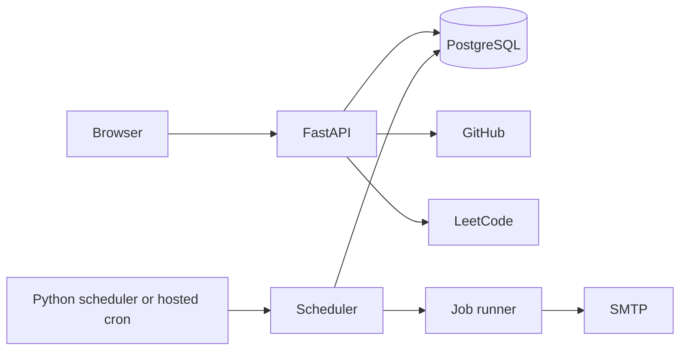
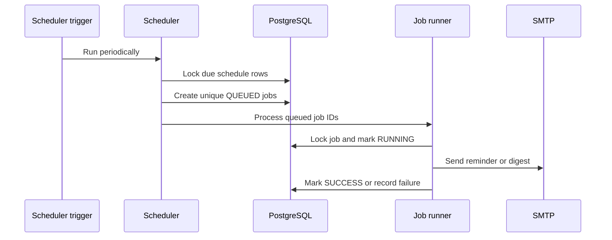

# Pace Interview Guide

Pace is a multi-user productivity platform that combines tasks, daily routines, focus sessions, GitHub activity, LeetCode progress, reminders, and email summaries. Each account has a private workspace.

## High-level design

FastAPI serves the frontend and authenticated REST API. PostgreSQL stores application data and scheduled jobs. A scheduler finds due reminders and summaries, creates durable job rows, and passes queued job IDs to a small runner. The runner sends email and records success or failure.

## Main parts

| Part | Responsibility |
|---|---|
| `app/` | API routes, authentication, database models, services, and frontend |
| `scheduler/` | Finds due work and creates unique database jobs |
| `worker/` | Builds reminders/digests, sends email, and updates job state |
| `alembic/` | Versioned PostgreSQL schema changes |
| `tests/` | Isolated checks for the main application flows |

## Data model

- `users`: account identity and OAuth provider IDs
- `preferences`: email, timezone, and daily/weekly digest choices
- `tasks`: one-time work, priority, due time, reminder, and completion
- `daily_tasks` and `daily_task_completions`: recurring routines and their history
- `focus_sessions`: start/end times, duration, notes, and linked work
- `activities`: one timeline for Pace, GitHub, and LeetCode activity
- `external_profiles`: connected public profiles and last-sync state
- `jobs`: reminder/digest type, unique occurrence, status, attempts, and errors

Every private query includes `user_id`, including scheduled jobs and summary queries.

## Authentication flow

1. A user signs up with a password or signs in through GitHub/Google OAuth.
2. Pace finds or creates the matching user.
3. Pace signs a seven-day JWT containing the user ID.
4. The browser stores it in an HttpOnly cookie.
5. Protected routes verify the token and use its user ID for database queries.

Passwords use salted `scrypt` hashes. OAuth access tokens are used during login but are not stored.

## Task and focus flow

Task and routine changes go through FastAPI into PostgreSQL. Completing work also creates an activity record. Starting a focus session records its server timestamp; stopping it calculates duration and creates a focus activity. The dashboard reads activities by the user's local date.

## GitHub and LeetCode flow

Users paste public profile URLs, not access tokens. Pace imports GitHub events/commits and recent accepted LeetCode submissions, assigns stable external IDs, and avoids duplicates. Provider errors and rate limits remain external dependencies.

## Reminder and digest flow

A failed job returns to `QUEUED` for another scheduled run. After three failed attempts it becomes `FAILED`. PostgreSQL keeps the error and attempt count for inspection. Unique occurrence keys, reminder markers, stored next-run times, and row locks prevent duplicate job creation.

This design uses PostgreSQL as both the application database and the small job queue. That is appropriate for Pace's workload and removes the operational cost of Kafka or a separate message broker. A broker would become useful only if job volume or the number of independent consumers grew significantly.

## Time handling

Timestamps are stored in UTC. Preferences use an IANA timezone such as `Asia/Kolkata`. The scheduler converts local digest times and daily/weekly boundaries to UTC before querying, so summaries follow the user's calendar rather than the server clock.

## Email summaries

The daily digest contains completed, pending, overdue, and next-day tasks plus routines, focus, GitHub, and LeetCode activity. The weekly summary reports completion rate, high-priority work, most productive day, overdue tasks, and activity totals. SMTP configuration is supplied through environment variables; tests use console mode and do not send real mail.

## Reliability and tradeoffs

- Database constraints protect unique users, active focus sessions, external events, and job occurrences.
- Row locks reduce competing scheduler work.
- Jobs persist across process restarts and retain attempts and errors.
- Retries are bounded at three attempts.
- The simple runner has no delayed backoff or separate broker. Add a dedicated queue only when measured traffic requires it.
- JWTs are signed, not encrypted, and there is no server-side token revocation list.

## Testing and CI

GitHub Actions starts PostgreSQL, applies and checks Alembic migrations, compiles the code, and runs focused modules covering tasks, preferences, scheduling, routines, authentication, OAuth, focus, activities, profile sync, email, and hosting behavior.

## Strong interview summary

> I built Pace as a multi-user productivity platform with FastAPI and PostgreSQL. It keeps each user's tasks, routines, focus sessions, and imported developer activity private. GitHub and Google OAuth issue HttpOnly JWT sessions. For reminders and summaries, a timezone-aware scheduler creates unique PostgreSQL jobs, and a small runner processes them with saved state and three bounded attempts. I chose a database-backed queue instead of Kafka because it is simpler and sufficient for the expected workload.

## Questions to prepare

1. How does `user_id` prevent data leakage between accounts?
2. Why are JWTs stored in HttpOnly cookies?
3. How do occurrence keys and row locks prevent duplicate jobs?
4. Why are timestamps stored in UTC but schedules evaluated in local time?
5. When would you replace the PostgreSQL job queue with a message broker?
6. What happens when SMTP fails three times?
7. How are GitHub and LeetCode records deduplicated?
