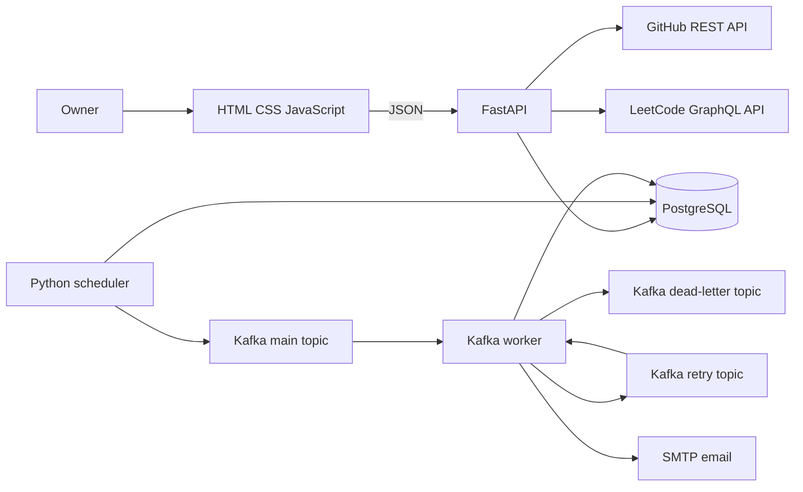
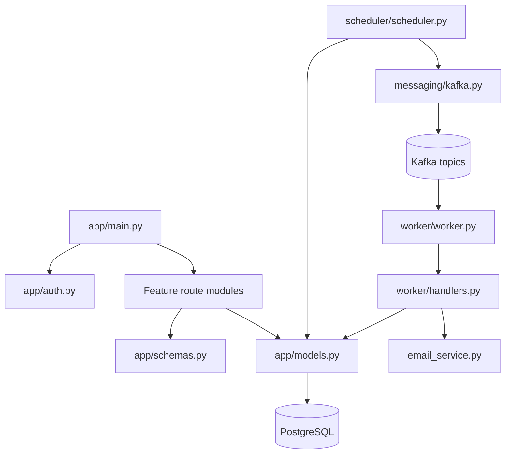
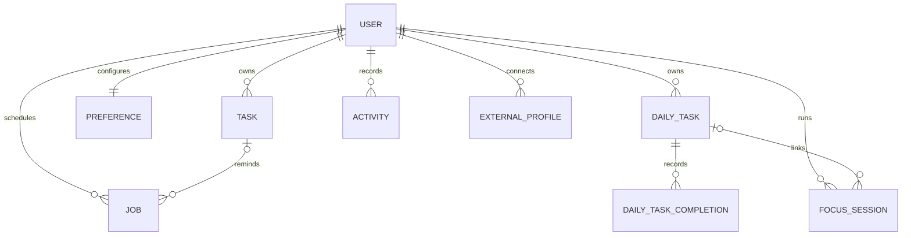
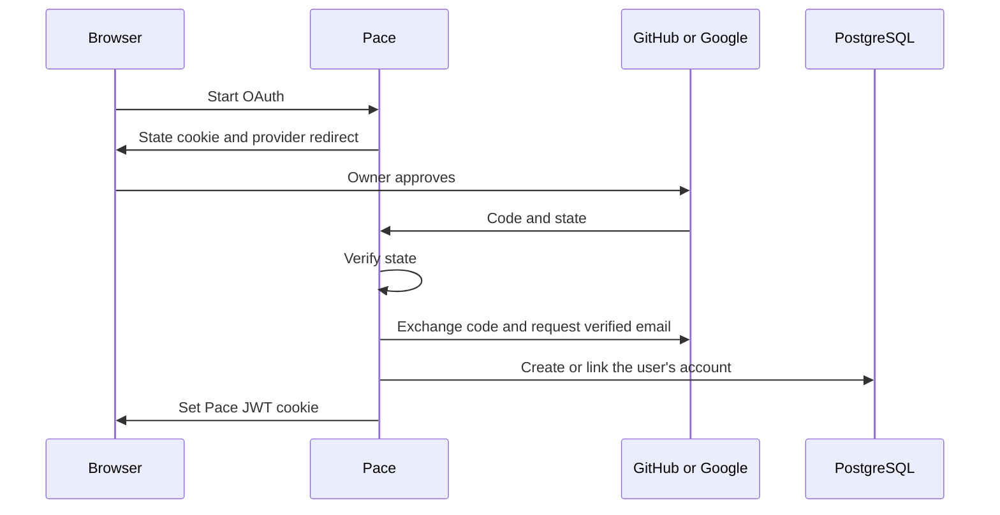
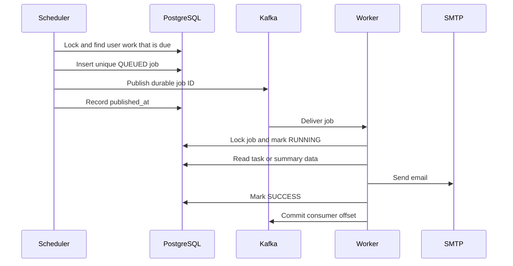

# Pace — Interview Study Guide

This guide explains the current repository: a multi-user personal productivity platform demonstrating backend design, durable scheduling, Kafka processing, authentication, external integrations, and testing. It is a portfolio reference project, not a production deployment.

## 1. One-sentence explanation

Pace combines tasks, daily routines, focus sessions, GitHub activity, and LeetCode progress in one personal dashboard, while a PostgreSQL-backed scheduler sends reminders and summaries through Kafka workers.

## 2. Problem and requirements

Productive work is normally split across a task list, timer, GitHub, and LeetCode. Pace provides one place to:

- plan one-time tasks with priorities, due dates, and reminders;
- repeat daily routines without resetting rows every midnight;
- run a focus timer that survives browser refreshes;
- import public GitHub and LeetCode activity;
- show completed work in one activity timeline and 84-day tracker;
- generate task reminders, daily digests, and weekly summaries;
- keep background work durable when a process restarts.

Pace supports multiple accounts with private data. It has local signup and optional OAuth, but no production-hosting claim.

## 3. Technology choices

| Technology | Responsibility |
|---|---|
| Python 3.12 | Application, scheduler, worker, integrations, and checks |
| FastAPI | HTTP routes, dependencies, and static frontend serving |
| Pydantic | Request validation and response serialization |
| SQLAlchemy | Models, queries, transactions, and row locking |
| PostgreSQL | Durable application and job state |
| Alembic | Repeatable schema migrations |
| Apache Kafka | Main, retry, and dead-letter job transport |
| HTML, CSS, JavaScript | Dependency-free browser interface |
| OAuth 2.0 | Optional GitHub or Google account authentication |
| HS256 JWT | Pace's own signed login session |
| SMTP | Optional email delivery; console output during development |
| GitHub Actions | PostgreSQL-backed CI only |

## 4. High-level design

There are two paths:

1. **Interactive:** browser → FastAPI → PostgreSQL or coding provider → browser.
2. **Background:** scheduler → PostgreSQL job → Kafka → worker → SMTP → PostgreSQL result.

Kafka is not the scheduler. The scheduler decides what is due; Kafka transports job IDs to workers.

## 5. Low-level design

Important modules:

- `app/main.py` assembles FastAPI and serves `app/static`.
- `app/auth.py` implements signup, login, OAuth, password hashing, JWT creation, and verification.
- `app/api/*.py` contains task, routine, focus, activity, profile, preference, and job endpoints.
- `app/models.py` defines persisted state and database constraints.
- `app/schemas.py` validates API input.
- `scheduler/scheduler.py` calculates occurrences and publishes jobs.
- `messaging/kafka.py` confirms producer delivery.
- `worker/worker.py` consumes, locks, retries, and completes jobs.
- `worker/handlers.py` builds reminders and summaries.
- `email_service.py` sends through SMTP or prints safely when SMTP is absent.

## 6. Data model

Every private row carries `user_id`, giving interactive and background queries an explicit account boundary.

Main tables:

- **User:** credentials, email, display name, and OAuth IDs.
- **Task:** current one-time work, priority, due/reminder time, and completion state.
- **Preference:** timezone, email address, and digest schedules.
- **DailyTask:** recurring routine definition.
- **DailyTaskCompletion:** one dated routine occurrence.
- **FocusSession:** authoritative server start/end timestamps and optional routine link.
- **Activity:** normalized history from Pace, GitHub, and LeetCode.
- **ExternalProfile:** connected public provider username and sync timestamp.
- **Job:** background type, state, occurrence key, attempts, timestamps, and error.

Important guarantees include one routine completion per date, one active focus session, stable activity deduplication, one job per schedule occurrence, foreign keys, indexes, and state checks. Application checks provide friendly errors; database constraints remain the final protection against races.

## 7. Authentication workflow

### Local signup and login

Signup creates an account whose password is salted and hashed with `scrypt`. Login accepts that account's username or email. `APP_USERNAME` and `APP_PASSWORD` may optionally bootstrap the first account.

### OAuth

A new verified email creates a separate account. Provider tokens are used only during the callback and are not persisted.

### JWT session

Pace issues its own seven-day HS256 JWT containing `sub`, `iat`, and `exp`. Verification checks the expected algorithm, signature, expiry, integer subject, and existing user. The cookie is HttpOnly and SameSite Strict. OAuth proves identity; the Pace JWT represents the application session.

## 8. Core workflows

### Task completion

The route loads the authenticated user's task, changes `PENDING` to `COMPLETED`, records server UTC time, and inserts a matching activity in one transaction. Reopening clears the time and removes the generated activity.

### Daily routine

A routine is a definition; completion is a separate dated occurrence. Pace calculates today in the configured IANA timezone and inserts one completion row. A unique constraint makes repeated clicks safe.

### Focus timer

The server stores the start timestamp. The browser only renders elapsed time from that value, so refreshes do not lose the session. A unique active-slot rule prevents two concurrent timers. Stopping locks the row, records the end, calculates duration, and creates an activity.

### Activity and external sync

Task, routine, focus, GitHub, and LeetCode work become normalized Activity rows. A user connects a public GitHub or LeetCode URL, not a personal token. Provider adapters validate the host, fetch public data, and use stable external IDs to prevent duplicate imports.

## 9. Scheduling and Kafka workflow

### Why both PostgreSQL and Kafka?

PostgreSQL owns business state: the job definition, status, attempts, and errors. Kafka transports work and supports consumer groups. Messages contain a durable job ID, so workers always read current database state.

### Duplicate prevention

- due rows use `SELECT FOR UPDATE SKIP LOCKED`;
- reminders record `reminder_processed_at`;
- preferences store their next occurrence;
- jobs use unique occurrence keys;
- `published_at` is set only after Kafka confirms delivery;
- workers lock jobs and ignore terminal states.

### Retry and dead-letter behavior

The worker changes `QUEUED → RUNNING`. A failure records the error and increments attempts. Attempts one and two return to `QUEUED` and publish to the retry topic. Attempt three becomes `FAILED` and publishes to the dead-letter topic. Success becomes `SUCCESS`.

This is at-least-once processing, not exactly-once email. A crash after SMTP accepts a message but before PostgreSQL records success can cause a duplicate retry.

## 10. Timezone design

- Real instants are stored as timezone-aware UTC.
- Preferences use an IANA name such as `Asia/Kolkata`.
- Human schedule times are interpreted in that zone and converted to UTC.
- Daily queries use `[local midnight, next local midnight)` converted to UTC.
- Weekly summaries use the previous Monday-to-Monday local interval.

This respects calendar meaning and daylight-saving rules better than adding a fixed offset.

## 11. Email boundary

The handler calls `send_email(to, subject, body)`. With `SMTP_HOST`, it uses authenticated SMTP and optional STARTTLS. Without SMTP, it prints the rendered message. Kafka does not send email itself: it delivers the job to the worker, and the worker calls SMTP.

## 12. CI and verification

GitHub Actions CI starts PostgreSQL 17, installs dependencies, applies Alembic migrations, runs `alembic check`, compiles the project, and runs nine subsystem checks. Coverage includes CRUD, per-user isolation, preferences, background jobs, routines, authentication, OAuth account linking, focus conflicts, activities, and profile synchronization.

CI tests the repository; it does not deploy Pace.

## 13. Why this is a sensible SDE project

Pace connects API design, relational modeling, migrations, OAuth/JWT, transactions, constraints, row locks, scheduling, Kafka consumer groups, bounded retry, dead-letter routing, timezone logic, external APIs, and PostgreSQL-backed CI.

The interactive code remains one modular FastAPI application. Kafka is used only for the real background-work boundary rather than placed between ordinary CRUD calls.

## 14. Honest limitations

- It supports multiple private user workspaces but is not production deployed.
- Kafka, scheduler, and worker must run for background email.
- SMTP credentials are required for real delivery.
- Retry-topic consumption has no delayed exponential backoff.
- Email is at-least-once, not exactly-once.
- Provider sync depends on upstream availability and rate limits.
- JWT sessions have no server-side revocation list.
- Tests are subsystem checks, not a full browser suite.
- The repository makes no production-scale, uptime, or deployment claim.

## 15. Common interview questions

### Why Kafka?

It separates due-work detection from execution, supports consumer-group processing, and provides explicit retry and dead-letter paths. PostgreSQL remains the source of truth.

### Why not APScheduler?

Pace already needs database schedule state, occurrence keys, and worker retries. The small loop only checks due rows and publishes jobs; another scheduling library would not replace those rules.

### Why not microservices?

The interactive application is small and cohesive. A modular monolith avoids network and deployment overhead. Only background execution is separated because it has a different lifecycle.

### How are duplicate reminders prevented?

Row locks, reminder markers, stored next occurrences, unique job keys, confirmed Kafka publication, and worker state checks work together.

### What happens when a worker crashes?

PostgreSQL retains the job. Kafka can redeliver an uncommitted message. The worker locks the row and checks its state before processing.

## 16. Study order

1. Trace one task request through JavaScript, FastAPI, SQLAlchemy, and PostgreSQL.
2. Learn Task, Activity, Preference, and Job.
3. Trace local login, OAuth, and JWT verification.
4. Trace `claim_due_work()` for one reminder.
5. Follow the job ID through Kafka and `process_job()`.
6. Explain retry and dead-letter state without notes.
7. Practice UTC/local-day examples around midnight.
8. Read CI and explain what each command proves.

## 17. Interview story formula

Use: **Problem → requirement → engineering decision → implementation → result → tradeoff.**

> Reminders must work outside an HTTP request. I needed durable state and recoverable processing, so the scheduler stores one occurrence as a PostgreSQL job and publishes only its ID to Kafka. A consumer-group worker locks that row, sends the email, and records success or a bounded retry. Unique occurrence keys and row locks prevent duplicate creation. The tradeoff is operating Kafka for a personal project, but it demonstrates a clear asynchronous boundary and failure-handling model.
