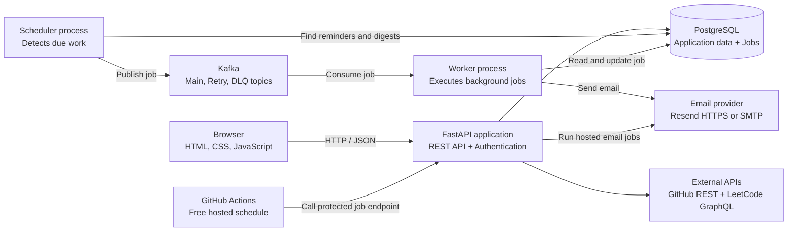

# Pace

[](https://github.com/rajeev8008/Pace/actions/workflows/ci.yml)

[](LICENSE)

I wanted one honest view of my productivity. My daily routines and scheduled tasks lived in one place, focus time existed only in my head, and the work I did on GitHub and LeetCode was scattered across separate profiles. Pace brings those signals together so I can plan what I intend to do and review what I actually accomplished each day. Daily digests and weekly summaries turn that history into a simple reflection I can read, recognize my progress, and feel accomplished.

Pace is a personal productivity platform for daily routines, one-time tasks, focus sessions, developer activity, consistency tracking, reminders, and email summaries.

<p align="center">
  
  
</p>
<p align="center">
  
  
</p>

## What Pace tracks

- **Daily routines** — repeatable work that resets each local calendar day
- **Scheduled tasks** — one-time work with priority, due date, and reminder controls
- **Focus** — one active timer linked to a daily routine
- **Activity** — completed tasks, routines, focus sessions, GitHub work, and accepted LeetCode submissions
- **Consistency** — an 84-day contribution-style view with repository commit totals and solved problems

GitHub synchronization imports authored commits plus pull requests, issues, releases, and other profile events. Commits are grouped by repository with their count and latest time. LeetCode synchronization imports recent accepted submissions with problem numbers and titles.

### Engineering highlights

- Timezone-correct FastAPI and PostgreSQL application with HttpOnly JWT authentication and OAuth
- Durable scheduled jobs with a direct free-hosting path plus optional Kafka workers
- Unified activity model for Pace completions, GitHub development, and LeetCode practice
## Architecture



FastAPI serves the dependency-free frontend and authenticated REST API. PostgreSQL is the source of truth. The full local architecture can publish jobs through Kafka, while the free hosted setup processes the same durable jobs through a protected scheduled endpoint and sends email through Resend's HTTPS API.

All stored timestamps are timezone-aware UTC values. Daily and weekly calculations use the configured IANA timezone—`Asia/Kolkata` by default—and convert local calendar boundaries to UTC before querying.

## Stack

Python, FastAPI, Pydantic, PostgreSQL, SQLAlchemy, Alembic, Apache Kafka, confluent-kafka, OAuth 2.0, HS256 JWT, HTML, CSS, JavaScript, Resend/SMTP, GitHub Actions, GitHub Pages, Neon, and Render.

Authentication uses salted `scrypt` password hashes, seven-day HS256 JWTs stored in HttpOnly cookies, and GitHub or Google OAuth. Pace intentionally permits one owner account.

## Project structure

```text
app/         FastAPI routes, models, services, and frontend
alembic/     Versioned PostgreSQL migrations
messaging/   Kafka producer and topic setup
scheduler/   Due-work detection and job publication
worker/      Kafka consumer and email handlers
tests/       Isolated subsystem checks
render.yaml  Web and PostgreSQL deployment blueprint
```

## Local setup

Requirements: Python 3.11+, PostgreSQL, Java, and Kafka.

```powershell
python -m venv .venv
& ".\.venv\Scripts\python.exe" -m pip install -r requirements.txt
Copy-Item .env.example .env
& ".\.venv\Scripts\alembic.exe" upgrade head
```

Configure `.env` with PostgreSQL and a strong `SESSION_SECRET`. Add OAuth, `GITHUB_SYNC_TOKEN`, and `SMTP_*` values only when those integrations are needed. Gmail SMTP requires an App Password.

Run the web application, then start the background components in separate terminals:

```powershell
& ".\.venv\Scripts\python.exe" -m uvicorn app.main:app --reload
& ".\.venv\Scripts\python.exe" -m messaging.setup_kafka
& ".\.venv\Scripts\python.exe" -m scheduler.scheduler
& ".\.venv\Scripts\python.exe" -m worker.worker
```

Open `http://127.0.0.1:8000`.

## Free deployment

[](https://render.com/deploy?repo=https://github.com/rajeev8008/Pace)

The repository is configured for this free hobby-project split:

- **GitHub Pages** serves `app/static` at `https://rajeev8008.github.io/Pace/`.
- **Render** runs FastAPI at `https://pace-rajeev8008.onrender.com`.
- **Neon** provides persistent free PostgreSQL instead of Render's 30-day free database.
- **Resend** delivers mail over HTTPS because free Render services block SMTP ports.
- **GitHub Actions** calls the protected job endpoint every ten minutes so reminders and summaries run without a paid worker or Kafka broker.

Deploy the Render Blueprint, entering `DATABASE_URL`, `CRON_SECRET`, OAuth credentials, `RESEND_API_KEY`, and `RESEND_FROM`. Add the same `CRON_SECRET` as a GitHub Actions repository secret, then enable Pages with **GitHub Actions** as its source.

Register these OAuth callbacks:

```text
https://pace-rajeev8008.onrender.com/auth/oauth/github/callback
https://pace-rajeev8008.onrender.com/auth/oauth/google/callback
```

Free services can cold-start and scheduled GitHub Actions can be delayed, so this is suitable for a personal project rather than time-critical notifications. The Render-hosted `/` remains a same-origin fallback for browsers that block cross-site cookies used by the Pages frontend.

## Verification

GitHub Actions starts PostgreSQL, applies and checks Alembic migrations, compiles the project, and runs isolated checks for tasks, preferences, scheduling, routines, authentication, OAuth, focus sessions, activities, and profile synchronization.

```powershell
& ".\.venv\Scripts\alembic.exe" check
& ".\.venv\Scripts\python.exe" -m compileall -q app messaging scheduler worker tests
Get-ChildItem tests\test_*.py | ForEach-Object { & ".\.venv\Scripts\python.exe" -m "tests.$($_.BaseName)" }
```

## Author

Developed by **K Rajeev**.

## License

[MIT](LICENSE)
