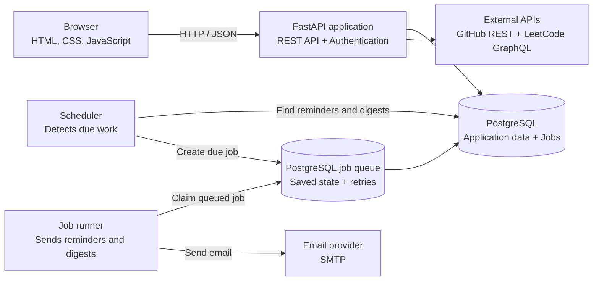

# Pace

[](https://github.com/rajeev8008/Pace/actions/workflows/ci.yml)

[](LICENSE)

**Live:** [pace-rajeev8008.onrender.com](https://pace-rajeev8008.onrender.com)

I wanted one honest view of my productivity. My daily routines and scheduled tasks lived in one place, focus time existed only in my head, and the work I did on GitHub and LeetCode was scattered across separate profiles. Pace brings those signals together so I can plan what I intend to do and review what I actually accomplished each day. Daily digests and weekly summaries turn that history into a simple reflection I can read, recognize my progress, and feel accomplished.

Pace is a personal productivity platform for daily routines, one-time tasks, focus sessions, developer activity, consistency tracking, reminders, and email summaries.

<p align="center">
  
  
</p>

<p align="center">
  
  
</p>

## What Pace includes

- **Private accounts** — password, GitHub, and Google sign-in with isolated data for every user
- **Planning** — daily routines and scheduled tasks with priorities, due dates, and reminders
- **Focus** — one active timer connected to the routine being worked on
- **Developer activity** — GitHub events and accepted LeetCode submissions imported from public profile links
- **Progress** — completed work collected into an 84-day consistency view
- **Digests** — timezone-aware daily or weekly email summaries based on each user's preference

## Architecture



The browser talks to one FastAPI application, while PostgreSQL remains the source of truth. The scheduler creates due jobs and the runner processes them from the database. Failed jobs return to the queue for up to three attempts, while unique occurrence keys prevent duplicate reminders and summaries.

### Engineering highlights

- Every database query and background job is scoped by authenticated `user_id`
- Password authentication plus GitHub and Google OAuth, with JWTs stored in HttpOnly cookies
- UTC storage with IANA-timezone boundaries for accurate daily and weekly scheduling
- Persisted jobs, duplicate-job prevention, and three bounded delivery attempts
- Alembic migrations and PostgreSQL-backed checks in GitHub Actions

## Stack

- **Backend:** Python, FastAPI, Pydantic, SQLAlchemy, Alembic, PostgreSQL
- **Background work:** PostgreSQL job queue, Python scheduler, SMTP
- **Frontend:** HTML, CSS, and JavaScript
- **Security and delivery:** OAuth 2.0, HttpOnly JWT cookies, GitHub Actions

## Project structure

```text
app/         FastAPI routes, models, services, and frontend
alembic/     Versioned PostgreSQL migrations
scheduler/   Due-work detection and job processing loop
worker/      Job execution and email handlers
tests/       Isolated subsystem checks
```

## Local setup

Requirements: Python 3.11+ and PostgreSQL.

```powershell
python -m venv .venv
& ".\.venv\Scripts\python.exe" -m pip install -r requirements.txt
Copy-Item .env.example .env
& ".\.venv\Scripts\alembic.exe" upgrade head
```

Configure `.env` with PostgreSQL and a strong `SESSION_SECRET`. Add OAuth, GitHub sync, and SMTP values only for the integrations you want to run; Gmail SMTP requires an App Password.

Run the web application, then start the scheduler in a separate terminal:

```powershell
& ".\.venv\Scripts\python.exe" -m uvicorn app.main:app --reload
& ".\.venv\Scripts\python.exe" -m scheduler.scheduler
```

Open `http://127.0.0.1:8000`.

## Verification

GitHub Actions starts PostgreSQL, applies and checks Alembic migrations, compiles the project, and runs isolated checks for tasks, preferences, scheduling, routines, authentication, OAuth, focus sessions, activities, and profile synchronization.

```powershell
& ".\.venv\Scripts\alembic.exe" check
& ".\.venv\Scripts\python.exe" -m compileall -q app scheduler worker tests
Get-ChildItem tests\test_*.py | ForEach-Object { & ".\.venv\Scripts\python.exe" -m "tests.$($_.BaseName)" }
```

## Author

Developed by **K Rajeev**.

## License

[MIT](LICENSE)
