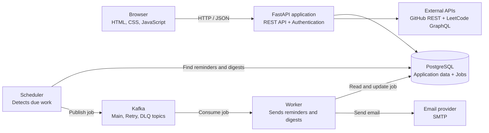

# Pace

[](https://github.com/rajeev8008/Pace/actions/workflows/ci.yml)

[](LICENSE)

**Live:** [pace-rajeev8008.onrender.com](https://pace-rajeev8008.onrender.com)

I wanted one honest view of my productivity. My daily routines and scheduled tasks lived in one place, focus time existed only in my head, and the work I did on GitHub and LeetCode was scattered across separate profiles. Pace brings those signals together so I can plan what I intend to do and review what I actually accomplished each day. Daily digests and weekly summaries turn that history into a simple reflection I can read, recognize my progress, and feel accomplished.

Pace is a personal productivity platform for daily routines, one-time tasks, focus sessions, developer activity, consistency tracking, reminders, and email summaries.

<p align="center">
  
  
</p>
<p align="center">
  
  
</p>

## What Pace includes

- **Private accounts** — password, GitHub, and Google sign-in with isolated data for every user
- **Planning** — daily routines and scheduled tasks with priorities, due dates, and reminders
- **Focus** — one active timer connected to the routine being worked on
- **Developer activity** — GitHub events and accepted LeetCode submissions imported from public profile links
- **Progress** — completed work collected into an 84-day consistency view
- **Digests** — timezone-aware daily or weekly email summaries based on each user's preference

## Architecture



The browser talks to one FastAPI application, while PostgreSQL remains the source of truth. The scheduler persists due work before publishing it to Kafka; workers process jobs through consumer groups, retry temporary failures, and route exhausted jobs to a dead-letter topic. This keeps reminders and summaries separate from web requests and prevents duplicate delivery.

### Engineering highlights

- Every database query and background job is scoped by authenticated `user_id`
- Password authentication plus GitHub and Google OAuth, with JWTs stored in HttpOnly cookies
- UTC storage with IANA-timezone boundaries for accurate daily and weekly scheduling
- Persisted jobs, duplicate-job prevention, bounded retries, and dead-letter routing
- Alembic migrations and PostgreSQL-backed checks in GitHub Actions

## Stack

- **Backend:** Python, FastAPI, Pydantic, SQLAlchemy, Alembic, PostgreSQL
- **Background work:** Apache Kafka, confluent-kafka, SMTP
- **Frontend:** HTML, CSS, and JavaScript
- **Security and delivery:** OAuth 2.0, HttpOnly JWT cookies, GitHub Actions

## Project structure

```text
app/         FastAPI routes, models, services, and frontend
alembic/     Versioned PostgreSQL migrations
messaging/   Kafka producer and topic setup
scheduler/   Due-work detection and job publication
worker/      Kafka consumer and email handlers
tests/       Isolated subsystem checks
```

## Local setup

Requirements: Python 3.11+, PostgreSQL, Java, and Kafka.

```powershell
python -m venv .venv
& ".\.venv\Scripts\python.exe" -m pip install -r requirements.txt
Copy-Item .env.example .env
& ".\.venv\Scripts\alembic.exe" upgrade head
```

Configure `.env` with PostgreSQL and a strong `SESSION_SECRET`. Add OAuth, GitHub sync, and SMTP values only for the integrations you want to run; Gmail SMTP requires an App Password.

Run the web application, then start the background components in separate terminals:

```powershell
& ".\.venv\Scripts\python.exe" -m uvicorn app.main:app --reload
& ".\.venv\Scripts\python.exe" -m messaging.setup_kafka
& ".\.venv\Scripts\python.exe" -m scheduler.scheduler
& ".\.venv\Scripts\python.exe" -m worker.worker
```

Open `http://127.0.0.1:8000`.

## Verification

GitHub Actions starts PostgreSQL, applies and checks Alembic migrations, compiles the project, and runs isolated checks for tasks, preferences, scheduling, routines, authentication, OAuth, focus sessions, activities, and profile synchronization.

```powershell
& ".\.venv\Scripts\alembic.exe" check
& ".\.venv\Scripts\python.exe" -m compileall -q app messaging scheduler worker tests
Get-ChildItem tests\test_*.py | ForEach-Object { & ".\.venv\Scripts\python.exe" -m "tests.$($_.BaseName)" }
```

## Author

Developed by **K Rajeev**.

## License

[MIT](LICENSE)
