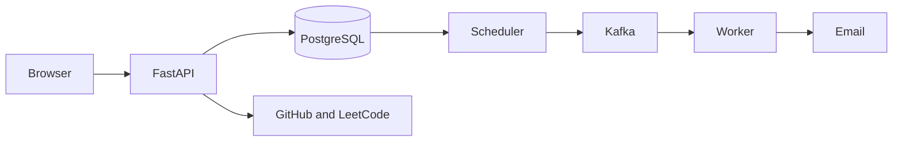

# Pace

I wanted one honest view of my productivity. My daily routines and scheduled tasks lived in one place, focus time existed only in my head, and the work I did on GitHub and LeetCode was scattered across separate profiles. Pace brings those signals together so I can plan what I intend to do and review what I actually accomplished each day.

Pace is a single-user productivity application for daily routines, one-time tasks, focus sessions, developer activity, consistency tracking, reminders, and email summaries.

<p align="center">
  
  
</p>
<p align="center">
  
  
</p>

## What Pace tracks

- **Daily routines** — repeatable work that resets each local calendar day
- **Scheduled tasks** — one-time work with priority, due date, and reminder controls
- **Focus** — one active timer linked to a daily routine
- **Activity** — completed tasks, routines, focus sessions, GitHub work, and accepted LeetCode submissions
- **Consistency** — an 84-day contribution-style view with repository commit totals and solved problems

GitHub synchronization imports authored commits plus pull requests, issues, releases, and other profile events. Commits are grouped by repository with their count and latest time. LeetCode synchronization imports recent accepted submissions with problem numbers and titles.

## How it works



FastAPI serves the dependency-free frontend and authenticated REST API. PostgreSQL is the source of truth. A separate scheduler claims due reminder and digest work, persists jobs, and publishes them to Kafka. Workers in the `dayflow-workers` consumer group execute jobs, retry failures up to three times, route exhausted jobs to a dead-letter topic, and deliver email through SMTP.

All stored timestamps are timezone-aware UTC values. Daily and weekly calculations use the configured IANA timezone—`Asia/Kolkata` by default—and convert local calendar boundaries to UTC before querying.

## Stack

Python, FastAPI, Pydantic, PostgreSQL, SQLAlchemy, Alembic, Apache Kafka, confluent-kafka, HTML, CSS, JavaScript, SMTP, GitHub Actions, and Render.

Authentication uses salted `scrypt` password hashes, signed seven-day HttpOnly session cookies, and optional GitHub or Google OAuth. Pace intentionally permits one owner account.

## Local setup

Requirements: Python 3.11+, PostgreSQL, Java, and Kafka.

```powershell
python -m venv .venv
& ".\.venv\Scripts\python.exe" -m pip install -r requirements.txt
Copy-Item .env.example .env
& ".\.venv\Scripts\alembic.exe" upgrade head
```

Configure `.env` with PostgreSQL and a strong `SESSION_SECRET`. Add OAuth, `GITHUB_SYNC_TOKEN`, and `SMTP_*` values only when those integrations are needed. Gmail SMTP requires an App Password.

Run the web application, then start the background components in separate terminals:

```powershell
& ".\.venv\Scripts\python.exe" -m uvicorn app.main:app --reload
& ".\.venv\Scripts\python.exe" -m messaging.setup_kafka
& ".\.venv\Scripts\python.exe" -m scheduler.scheduler
& ".\.venv\Scripts\python.exe" -m worker.worker
```

Open `http://127.0.0.1:8000`.

## Deployment

[](https://render.com/deploy?repo=https://github.com/rajeev8008/Pace)

The current Render Blueprint provisions FastAPI and PostgreSQL. A complete always-on deployment of scheduled email also needs a reachable Kafka broker plus continuously running scheduler and worker services with SMTP secrets. See [ARCHITECTURE.md](ARCHITECTURE.md) for the exact runtime boundaries.

## Verification

GitHub Actions starts PostgreSQL, applies and checks Alembic migrations, compiles the project, and runs isolated checks for tasks, preferences, scheduling, routines, authentication, OAuth, focus sessions, activities, and profile synchronization.

```powershell
& ".\.venv\Scripts\alembic.exe" check
& ".\.venv\Scripts\python.exe" -m compileall -q app messaging scheduler worker tests
Get-ChildItem tests\test_*.py | ForEach-Object { & ".\.venv\Scripts\python.exe" -m "tests.$($_.BaseName)" }
```

## Author

Developed by **K Rajeev**.

## License

[MIT](LICENSE)
