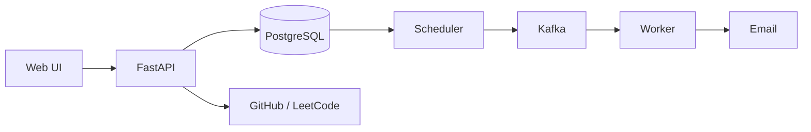

# Pace

Pace is a single-user productivity app for planning tasks, maintaining daily routines, running focus sessions, and reviewing what was accomplished.


## What it does

- Full CRUD for scheduled tasks with priorities, due dates, and reminders
- Daily routines that reset according to the configured timezone
- A dedicated focus timer linked to a routine
- Editable activity history and a 12-week consistency tracker
- GitHub commit, pull-request, and repository activity synchronization
- LeetCode accepted-submission synchronization
- Repository-grouped daily commit counts with latest activity times
- Daily digests, weekly summaries, and reminders over SMTP
- Password, GitHub, and Google sign-in using signed HttpOnly sessions
- Responsive light and dark interfaces

## Architecture



FastAPI serves the dependency-free frontend and REST API. PostgreSQL stores UTC timestamps and application state. A separate scheduler publishes due jobs to Kafka; workers process reminders and summaries with bounded retries and dead-letter routing. See [ARCHITECTURE.md](ARCHITECTURE.md) for details.

## Stack

Python, FastAPI, PostgreSQL, SQLAlchemy, Alembic, Apache Kafka, Pydantic, HTML, CSS, JavaScript, SMTP, GitHub Actions, and Render.

## Local setup

Requirements: Python 3.11+, PostgreSQL, and Kafka.

```powershell
python -m venv .venv
& ".\.venv\Scripts\python.exe" -m pip install -r requirements.txt
Copy-Item .env.example .env
& ".\.venv\Scripts\alembic.exe" upgrade head
```

Configure `.env` with PostgreSQL, a strong `SESSION_SECRET`, and any OAuth, GitHub sync, or SMTP credentials you use. Gmail requires an App Password.

Run the application and background services in separate terminals:

```powershell
& ".\.venv\Scripts\python.exe" -m uvicorn app.main:app --reload
& ".\.venv\Scripts\python.exe" -m messaging.setup_kafka
& ".\.venv\Scripts\python.exe" -m scheduler.scheduler
& ".\.venv\Scripts\python.exe" -m worker.worker
```

Open `http://127.0.0.1:8000`.

## Deployment

[](https://render.com/deploy?repo=https://github.com/rajeev8008/Pace)

The included Blueprint provisions the web service and PostgreSQL. Complete background email delivery also requires an always-on scheduler and worker, a reachable Kafka broker, and configured `SMTP_*` secrets.

## Verification

GitHub Actions applies migrations, checks for schema drift, compiles the project, and runs the isolated behavior checks. Run the same checks locally with:

```powershell
& ".\.venv\Scripts\alembic.exe" check
& ".\.venv\Scripts\python.exe" -m compileall -q app messaging scheduler worker tests
Get-ChildItem tests\test_*.py | ForEach-Object { & ".\.venv\Scripts\python.exe" -m "tests.$($_.BaseName)" }
```

## Author

Developed by **K Rajeev**.

## License

[MIT](LICENSE)
